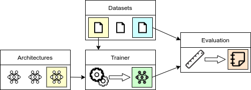

# Framework description

JADE is a simple framework designed to easily implement deep learning models and log results and architectures using Weights and Biases.

The main design principle consists in separating the definition of the following elements:
- `Dataset`: the data source. All pytorch datasets are supported by default, custom datasets can be easily added to the framework.
- `Trainer`: the training algorithm and which components need to be stored. 
- `Architecture`: the specific structure of the models used in the experiment.
- `Evaluation`:  the metrics to be computed regularly during training

The interaction between the aforementioned components is visualized in the following scheme:



Each component can be defined by writing the code in the respective `modules/` folder.
More details on the framework usage can be found in the **Usage** section

# Installation
The conda and pip dependencies required to run our code are specified in the `environment.yml` environment file and can be installed by running
```shell script
conda env create -f environment.yml
```
Activate the environment
```shell script
conda activate pytorch_and_friends
```

## Weights and Bias setup
Run the initialization command
```shell script
wandb init
```
and enter your username and password as required.

Set two environment variables 
```shell script
export WANDB_USER='<your_username>'
export WANDB_PROJECT='<your_project_name>'
```
before running your scripts.

# Usage

The JADE library allows to implement and run models on multiple datasets and hyper-parameters configurations.
The framework is designed so that new models, datasets and evaluation metrics and hyper-parameters can be added with 
minimal changes to the code by explicitly separating the different components. The implementation of a new model is done
in 6 steps, which are discussed in detail in the following sections:

1) Define the training algorithm. The implementation must extend the `core.trainer.Trainer` class.
  More details can be found in the section `Models and Algorithms`
2) Write the definition of the required neural networks architectures (section `Architectures`)
3) Create the dataset definition if not already supported by pytorch (section `Dataset`).
4) Define the evaluation metrics by extending the `Evaluation` class (section `Evaluation`)
5) Write the model configuration, dataset and evaluation .yaml file to specify the respective hyperparameters. (section `Parameters confituration`)
6) Run the model or define a sweep file for testing hyper-parameter ranges (section `Running the experiments`).

## Models and Algorithms
Each new Model and algorithm must extend the `core.Trainer` class and define the architecture initialization and training.
The models need to override the default `initialize(**params)` and `train_step(data)` as discussed in the following sections.
The framework is designed to make sure each model implementation is agnostic of the dataset and architectures to separate
the logic of the algorithm from its implementation details.

Place the implementations of your models in the `modules/models` folder.


### Initialization
All arguments of the `initialize(**params)` method can be directly specified in the corresponding configuration file (see section `Parameters confituration/Model and architectures`),
therefore all the parameters that needs to be explored can be added to the method signature.

```python
# Example of the Variational Autoencoder Model https://arxiv.org/abs/1312.6114

# Content of the models/VAE.py file

class VariationalAutoencoder(Trainer):
    def initialize(self, z_dim, encoder_layers, decoder_layers, beta, lr, batch_size, n_workers=0, sigma=1):
        # The value of the z_dim, n_encoder_layers, n_decoder_layers, beta lr, batch_size and n_workers are defined 
        # in the configuration file or specified as additional arguments when running the train python file
        
        # Store the value of the regularization strength beta for the loss computation
        self.beta = beta
```

Within the `initialize` method, the `self.instantiate_architecture(class, params)` method can be called to instantiate 
the corresponding class defined in the `Architecture file` (see section `Architectures`) with the specified parameters.

```python
        # initialize the encoder "Encoder(z_dim, layers)" defined in the architecture python file
        self.encoder = self.instantiate_architecture('Encoder', 
                                                     z_dim=z_dim, layers=encoder_layers)
        # initialize the encoder "Decoder(z_dim, layers, sigma)" defined in the architecture python file
        self.decoder = self.instantiate_architecture('Decoder', 
                                                     z_dim=z_dim, layers=decoder_layers, sigma=sigma)
        # Initialize the Gaussian prior passing the number of dimensions
        self.prior = self.instantiate_architecture('Prior', 
                                                   z_dim=z_dim)
        
        # Initialize the optimizer passing the parameters of encoder, decoder and the specified learning rate
        self.opt = Adam([
            {'params': self.encoder.parameters(), 'lr':lr},
            {'params': self.decoder.parameters(), 'lr':lr},
        ])
```
All the attributes (and architectures) that needs to be stored/restored can be specified by calling the 
`self.add_attribute_to_store(attribute_name)` method
```python
        # Store the parameters of encoder, decoder and optimizer
        self.add_attribute_to_store('encoder')
        self.add_attribute_to_store('decoder')
        self.add_attribute_to_store('opt')
```

The attribute `self.train_loader` also needs to be instantiated within the `initialize` method to specify the data loader
used during training. The datasets defined in the `Dataset` configuration files are available by accessing the 
`self.datasets[dataset_name]` attribute (see section `Parameters confituration/Dataset`)

```python
        # Instantiate a default pytorch DataLoader using the 'train' dataset defined in the dataset confituration file
        self.train_loader = DataLoader(self.datasets['train'],
                                       batch_size=batch_size, n_workers=n_workers, shuffle=True)
```

### Train Step
Each model needs to define a train step that will receive a batch of data from the train loader for each new iteration.
```python
    def train_step(self, data):
        # Note that the data is already moved to the device of the trainer and all the architectures are set to train mode
        x = data['x']
        
        rec_loss, reg_loss = self.compute_loss_components(x)

        # Add the two loss components to the log
        # Note that only scalars are currently supported although custom logging can be implemented
        # by extending the implemented methods
        self.add_loss_item('Rec Loss', rec_loss.item())
        self.add_loss_item('Reg Loss', reg_loss.item())
        
        loss = rec_loss + self.beta * reg_loss

        self.opt.zero_grad()
        loss.backward()
        self.opt.step()
        
    def compute_loss_components(self, x):
        # Encode a batch of data
        q_z_given_x = self.encoder(x)

        # Sample the representation using the re-parametrization trick
        z = q_z_given_x.rsample()

        # Compute the reconstruction distribution
        p_x_given_z = self.decoder(z)

        # The reconstruction loss is the expected negative log-likelihood of the input
        #  - E[log p(X=x|Z=z)]
        rec_loss = - p_x_given_z.log_prob(x).mean()

        # The regularization loss is the KL-divergence between posterior and prior
        # KL(q(Z|X=x)||p(Z)) = E[log q(Z=z|X=x) - log p(Z=z)]
        reg_loss = (q_z_given_x.log_prob(z) - self.prior().log_prob(z)).mean()

        return rec_loss, reg_loss
```

Different quantities can be easily added to the log by calling the `self.add_loss_item(name, value)`.
The values will be added to the corresponding tensorboard log. The logging frequency can be reduce by setting the 
`log_loss_every` variable (see section `Running the experiments`).
```python
        # Add the two loss components to the log
        # Note that only scalars are currently supported although custom logging can be implemented
        # by extending the implemented methods
        self.add_loss_item('Rec Loss', rec_loss.item())
        self.add_loss_item('Reg Loss', reg_loss.item())

```
The following methods can be extended if required:
- `on_start()`: method called only once after initialization
- `on_iteration_end()`: method called at the end of each training step. Don't forget to increment the iteration count if
this is overwritten
- `on_epoch_end()`: method called once at the end of each training epoch. Don't forget to increment the epoch count if 
this is overwritten
  
Each trainer also has a `end_training()` method that can be called within the training procedure or by any evaluator to
terminate the training procedure.

### Architectures
The different architectures that are instantiated in the Trainer described in the previous section
needs to be specified in the 'architectures_file'.
```python

# Content of the architectures/simple_MNIST.py file

# Model for p(Z|X)
class Encoder(nn.Module):
    def __init__(self, z_dim, layers):
        super(Encoder, self).__init__()
        
        # Create a stack of layers with ReLU activations as specified
        nn_layers = make_stack([N_INPUT] + layers)
            
        self.net = nn.Sequential(
            Flatten(),                                      # Layer to flatten the input
            *nn_layers,                                     # The previously created stack
            nn.ReLU(True),                                  # A ReLU activation
            StochasticLinear(n_hidden, z_dim, 'Normal')     # A layer that returns a factorized Normal distribution
        )

    def forward(self, x):
        # Note that the encoder returns a factorized normal distribution and not a vector
        return self.net(x) 

# ... The definition of Decoder are analogous and can be found in the `architectures/simple_MNIST.py` file
```
Note that the parameters can be passed when calling the `instantiate_architecture` in the model definition.

*IMPORTANT:* while models and datasets are automatically imported by the framework, the architecture file are passed when
running the training scipt. This allows the same architecture (e.g. `Encoder`) to have completely different implementations
for different datasets.

### Dataset
The default torchvision datasets are supported by the framework.
We recommend to create a simple Wrapper to make sure the Dataset object accepts only simple arguments such as float,
strings, list and dictionaries as parameters so that the dataset can be described with a simple yaml configuration file.
```python
# Content of examples/modules/data/MNIST.py

MNIST_TRAIN_EXAMPLES = 50000 # Size of the training set (the rest is used for validation)

class MNISTWrapper(Dataset):
    def __init__(self, root, split, download=False):
        # We add an extra argument 'split' to the signature to create a the validation set
        assert split in ['train', 'valid', 'train+valid', 'test']
        
        # Add the ToTensor() transform to convert PIL images into torch tensors
        dataset = MNIST(
            root=root,
            train=split in ['train', 'valid', 'train+valid'],
            transform=ToTensor(), download=download)

        if split == 'train':
            dataset = Subset(dataset, range(MNIST_TRAIN_EXAMPLES))
        elif split == 'valid':
            dataset = Subset(dataset, range(MNIST_TRAIN_EXAMPLES, len(dataset)))
        elif not (split == 'test') and not (split == 'train+valid'):
            raise Exception('The possible splits are "train", "valid", "train+valid", "test"')

        self.dataset = dataset

    def __getitem__(self, item):
        x, y = self.dataset[item]
        return {'x': x, 'y': y}
```
Unless a wrapper is required as in the example reported above to conver PIL images to tensors, torchvision classes 
can be referred directly from the configuration file.

### Evaluation
The Jade framework allows for the definition of arbitrarily evaluators used for logging purposes.
Each evaluator must extend the `jade.eval.Evaluaiton` class and extend the `initialize(**params)` and `evaluate()` methods.
Each evaluator has access to all the dataset definitions and the trainer object that can be easily accessed as attributes.

The `initialize(**params)` method is used for the initialization of the evaluator and receives the parameters form the
evaluation configuration file.
```python
# Code from modules/eval/elbo.py

class ELBOEvaluation(Evaluation):
    def initialize(self, 
                   evaluate_on,         # name of the dataset on which the metric is evaluated
                   n_samples=2048,      # number of evaluations to compute the expectation
                   resample_x=False,    # use the same x over time if false, otherwise shuffle randomly
                   batch_size=256       # batch size used for evaluation
                   ):
        # Make a data_loader for the specified dataset (names are defined in the dataset configuration file).
        # with a default batch size of 256 
        self.data_loader = DataLoader(self.datasets[evaluate_on], shuffle=resample_x, batch_size=batch_size)

        self.n_samples = n_samples
        self.batch_size = batch_size

        # Check that the model has a definition of the function used to compute training and evaluation errors
        if not hasattr(self.trainer, 'compute_loss_components'):
            raise Exception('The trainer must have a function `compute_loss_components` that returns reconstruction and regularization errror')

    def evaluate(self):
        evaluations = 0.
        elbo = 0.
        
        # Consider the device on which the model is located
        device = self.trainer.get_device()

        # Enable evaluation mode
        self.trainer.eval()
        
        # Disable gradient computation
        with torch.no_grad():
            for data in self.data_loader:
                # Move the data to the corresponding device
                x = data['x'].to(device)
                
                # Compute the two loss components
                rec_loss, reg_loss = self.trainer.compute_loss_components(x)
                elbo += rec_loss.sum() + reg_loss.sum()
                
                evaluations += self.batch_size
                if evaluations >= self.n_samples:
                    break

        return {
            'type': 'scalar',  # Type of the logged object, to be interpreted by the logger
            'value': elbo/evaluations,  # expectation to log
            'iteration': self.trainer.iterations  # Iteration count at the point of logging
        }
    
# The definition of the ImageReconstructionEvaluation class in analogous and reported in the modules/eval/rec_error.py file 
# ...
```
The frequency at which each evaluation is produced can be also specified from the evaluation configuration file.
At the moment only support for scalars and figures has been added, but the interface can be easily adapted to fit any
other data-type which is supported by tensorboard/wandb.

### Parameters configuration
The value of all the parameters for model training, dataset specification and evaluation needs to be included into 3 
respective `.yml` configuration files. Note that in each `.yaml` configuration file it is possible to refer to enviroment
variables with the syntax `$VARIABLE_NAME` (or `${VARIABLE_NAME}`). This allows to easily specify the location of datasets and devices to use
on different machines.

#### Dataset Configuration
The dataset configuration file contains the description of the class and parameters for the definition of the datasets
that are used during training and evaluation (validation and test).
The file describes a dictionary in which each key represent a different dataset (e.g. `train` and `test`) with the
respective parameters.

We define a configuration for the dataset used during validation and hyper-parameters search
```yaml
# Content of configurations/data/MNIST_valid.yml

# Define a dataset that will be identified with the key 'train'
train:
  # Class that will be instantiated (see the MNIST wrapper defined in the section above)
  class: MNISTWrapper
  # List of parameters that will be passed to the MNISTWrapper constructor
  params:
    # Note that the value of the environment variable DATA_ROOT will be replacing the corresponding token
    root: $DATA_ROOT
    split: train
    download: True
    
# We test a disjoint validation set which will be refered to as 'test'
test:
  class: MNISTWrapper
  params:
    root: $DATA_ROOT
    split: valid
    download: True
        
# Other splits or datasets can be defined here with arbitrary keys.
```
Analogously, we can define a configuration for the final training (after the hyper-parameter search) in which the model
is trained on train+validation set and tested on the test set
```yaml
# Content of configurations/data/MNIST_final.yml

train:
  class: MNISTWrapper
  params:
    root: $DATA_ROOT/datasets/MNIST
    split: train+valid # Train the model on validation + train set
    download: True
    
test:
  class: MNISTWrapper
  params:
    root: $DATA_ROOT/datasets/MNIST
    split: test # Test on the test set
    download: True        
```
At training time we can easily specify which one of the two configurations is used by specifying the respective
configuration file (see section `Running a model`).

Note that datasets that are not referred during training or evaluation will not be instantiated to avoid
unnecessary memory consumption, while datasets that are referred (with `self.datasets[<key>]` in the Trainer or Evaluation
modules) need to be described in the configuration file.

#### Evaluation Configuration
Analogously to the `dataset` file, the evaluation description `.yml` file contains a dictionary of evaluation metrics that
are considered during training.
Each evaluator will have the `evaluate_every` parameters other than the ones defined in the `initialize(**params)` method,
which specifies the frequency (in epochs) at which the evaluation function will be called.
```yaml
# Configuration in configurations/eval/VAE_simple.yml

# The key will be used as a name in the tensorboard/wandb log
TrainReconstructionsError:
  class: ELBOEvaluation         # We log the expected negative variational lower bound
  # Parameters of the initialize(**params) method of the ReconstructionEvaluation class
  params:
    evaluate_on: train          # On the training set

# Analogously, we define an evaluator for the ELBO of 'test' pictures
# (coming either from the validation or test set depending on the specified dataset configuration)
TestReconstructionsError:
  class: ELBOEvaluation         # The same metric is computed on the test dataset
  params:
    evaluate_on: test

# We also log the image reconstruction on train and test dataset using the ReconstructionEvaluation 
# defined in modules/eval/image_eval.py
TrainImageReconstructions:
  class: ReconstructionEvaluation
  params:
    evaluate_on: train
    n_pictures: 10
    sample_images: False
    # Frequency of evaluation (in epochs) if not specified, the default value is 1
    evaluate_every: 2

TestImageReconstructions:
  class: ReconstructionEvaluation
  params:
    evaluate_on: test
    n_pictures: 10
    sample_images: False
    evaluate_every: 2
```

Analogously we can write an evaluation description file for the final evaluation (model trained on train+evaluation and
tested on test) just by defining a second evaluation file (see `configurations/eval/VAE_simple_final.yml)


#### Model Configuration
Each model congiguration file includes a `class` descriptor that refers to a `Trainer` definition
and the description of its parameters:
```yaml
# Configuration in configurations/models/VAE.yml

class: VariationalAutoencoderTrainer
params:
  #################
  # Architectures #
  #################

  # Encoder
  encoder_layers:
    -1024
    -256

  # Decoder
  decoder_layers:
    - 256
    - 1024

  ###########################
  # Optimization parameters #
  ###########################

  # Learning Rate
  lr: 0.0001

  # Size of the training batch
  batch_size: 256

  # Read the number of workers from the environment variable
  num_workers: ${NUM_WORKERS}

  ##########################
  # Other model parameters #
  ##########################
  
  # regularization strength
  beta: 0.5
  
  # Number of latent dimensions
  z_dim: 64
```

## Running a model

In order to run a model launch the script `train.py` specifying the following flags

- `--data_conf`: path to the data configuration `.yml` file
- `--eval_conf`: path to the data configuration `.yml` file
- `--model_conf`: path to the model configuration `.yml` file
- `--arch_impl`: path to the architecture implementation `.py` file

Additional flags can be used to specify the device on which to run the model, maximum number of training epochs,
random seeds and model checkpoint frequency. For more information use the `--help` flag.

The flags '--device' and '--experiments-root' referring to the device on which the model is trained and the directory
in with the trained models and backups are stored can be also specified by setting the environment variables `DEVICE` 
and `EXPERIMENTS_ROOT` respectively.

## Creating a sweep
The whole JADE framework has been designed to facilitate parameters sweeps using the [wandb library](https://docs.wandb.ai/guides/sweeps/).
When writing a wandb sweep file, the parameters in the model, data and evaluation configurations can be easily accessed:
```yaml
# File in sweeps/simple_vae_sweep.yml

# Example of a sweep for the beta parameter and latent size of the Variational Autoencoder model
command:
- ${env}
- ${interpreter}
- ${program}
# Flags for the train.py script as explained above
- --data_conf=configurations/data/MNIST_valid.yml
- --eval_conf=configurations/eval/VAE_simple.yml
- --model_conf=configurations/models/VAE.yml
- --arch_impl=modules/architectures/simple_MNIST.py
- --epochs=10
- --seed=42
method: random
parameters:
# Model parameters can be accessed b${env}y using the operator '.' to access the members of dictionaries
# to access the parameters 'beta' in 'params' of a model (see the model configuration file) we use the syntax
# model.params.beta as shown below
  model.params.beta:
    # We sample the parameter beta between e^-10 and e^1 using a log-uniform distribution
    distribution: log_uniform
    min: -10
    max: 1
# We can also specify a value (or list of values) directly. This is going to override the default specified 
# in the model configuration file
  model.z_dim:
    values:
      - 32
program: train.py
```
The parameters defined in the model configuration file can be accessed using `model.params.<PARAMETER_NAME>`.
Analogously, the parameters regarding data and evaluation configuration can be accessed using `params.<PARAMETER_NAME>` 
and `eval.<EVAL_NAME>.params.<PARAMETER_NAME>`respectively.

Another example of a sweep configuration file for the bayesian hyper-parameter search on a
Variational Information Bottleneck can be found in `sweeps/simple_vib_sweep.yml`.


Once the sweep `.yml` file has been defined, run the corresponding wandb command to create a sweep
```
wandb sweep <sweep_file>
```

### Running sweep agents
The command will return a `sweep_id` that can be used to start the corresponding agents. Note that the `sweep_id`
```
wandg agent <wandb_user/wandb_project/sweep_id>
```

Note that conveniently the agents can be launched from different machines at the same time on the same sweep.
For each machine running an agent make sure that:
1) the code version and environment are consistent and updated
2) wandb has been initialized with the `wandb init` command
3) all the environment variables defined in the `.yml` files have been defined together with `WAND_USER` 
   and `WANDB_PROJECT`

#### Example of deployment for SLURM cluster
While the sweep declaration can be submitted from a local machine, running the agent usually requires
a certain amount of coumputational resources.

Here we report the procedure to deploy and run the agents on a cluster using SLURM for scheduling.
0) install conda on your cluster node. This will make it easier to deal with dependencies
1) make sure to download the code at the most recent version. If you are using git, you can simply run a `git clone` or 
   `git pull` to retrieve the most updated version of the code
2) install the conda environment `conda env create -f environment.yml`
3) make sure wandb is accessible and initialized with `wandb init`
4) create a .sbatch file for SLURM (see the documentation [here](https://slurm.schedmd.com/sbatch.html) ). here we report an example
```shell
#!/bin/bash

# SLURM flags (see https://slurm.schedmd.com/sbatch.html)

# Resource allocation
#SBATCH --gres=gpu:1
#SBATCH --mem=10G
#SBATCH --cpus-per-task=16
#SBATCH --time 10:00:00
#SBATCH --ntasks=1

# Other parameters
#SBATCH --priority=TOP
#SBATCH --job-name=<JOB_NAME>
#SBATCH -D <YOUR_HOME_DIRECTORY>
#SBATCH --output=log.txt
#SBATCH --verbose

# Cuda variables
export CUDA_HOME=/usr/local/cuda-10.0
export PATH=${CUDA_HOME}/bin:${PATH}
export LD_LIBRARY_PATH=${CUDA_HOME}/lib64:$LD_LIBRARY_PATH
export CUDA_CACHE_PATH="$TMPDIR"/.cuda_cache/
export CUDA_CACHE_DISABLE=0

# Setting the environment variables

# Weights and biases username and password
export WANDB_USER=<WANDB_USERNAME>
export WANDB_PROJECT=<WANDB_PROJECT>

# Parameters for number of cores for data-loading and device on which the model is placed
export NUM_WORKERS=16
export DEVICE=cuda

# Pointing to the directory in which the dataset is stored
export DATA_ROOT=<DATASET_ROOT> #(e.g. /hddstore/datasets)

# We use temp to save the backups since they are uploaded and deleted afterwards
mkdir /tmp/experiments
export EXPERIMENTS_ROOT=/tmp/experiments

#Generate cuda stats to check cuda is found
nvidia-smi
echo Starting

# Make sure you are in the project directory before trying to run the agent (the one containing the train.py file)
cd <PROJECT_DIRECTORY>

# Use python from the pytorch_and_friends environment
export PATH=$HOME/anaconda3/envs/pytorch_and_friends/bin/:$PATH

# Check that python and wandb are accessible
which python
which wandb

# Run the agent
echo Starting agent $WANDB_USER/$WANDB_PROJECT/$SWEEP_ID
wandb agent $SWEEP_ID
wait

# Remove all the files for the model backups since wandb is uploading them anyway
# You can change the experiments directory if you want to keep local versions
rm -r /tmp/experiments

```

5) Submit the SLURM job `sbatch --export=SWEEP_ID=<YOUR_SWEEP_ID> <YOUR_SLURM_FILE.sh>`

The console output and updated results for your agents can be found on the wandb website.

## Downloading and loading trained models
